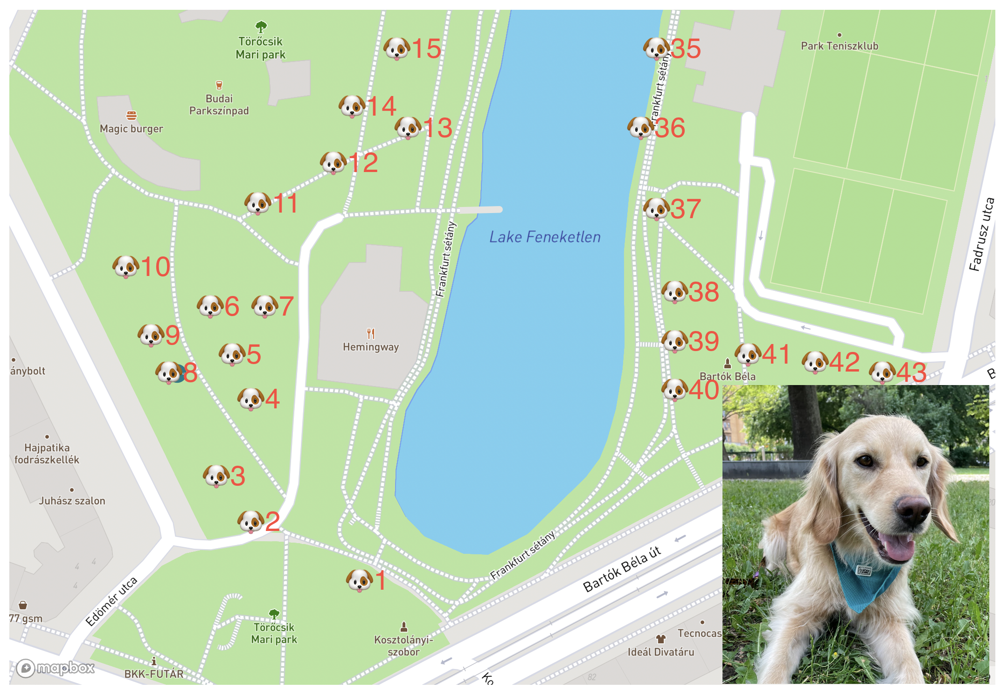

TAP_FINDMY_ITEM_NAME='abc'
TARGET_POSTGRES_USER=meltano
TARGET_POSTGRES_PASSWORD=meltano
TARGET_POSTGRES_DBNAME=warehouse
UTILITY_SUPERSET_MAPBOX_API_KEY=x

meltano run load-item-location-from-cache

